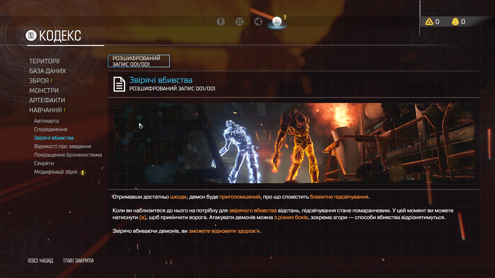
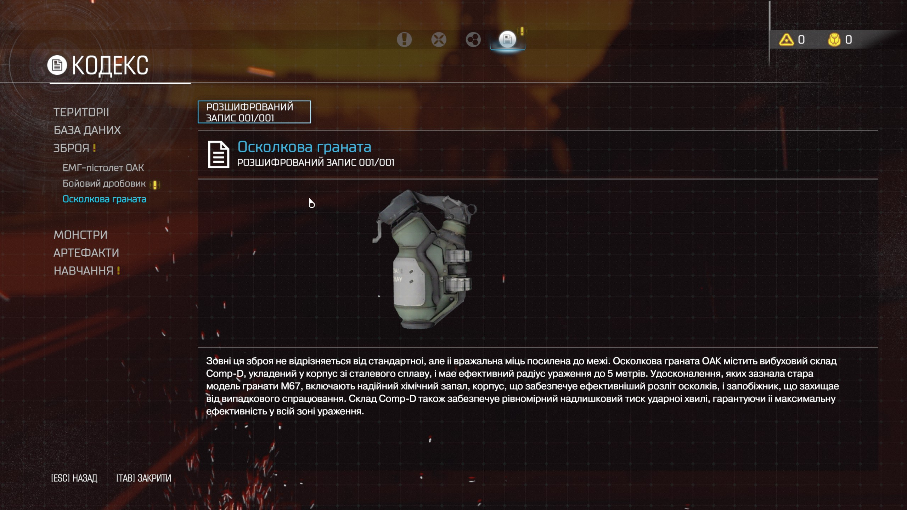
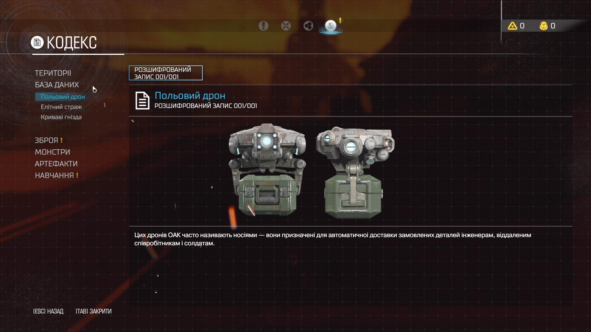
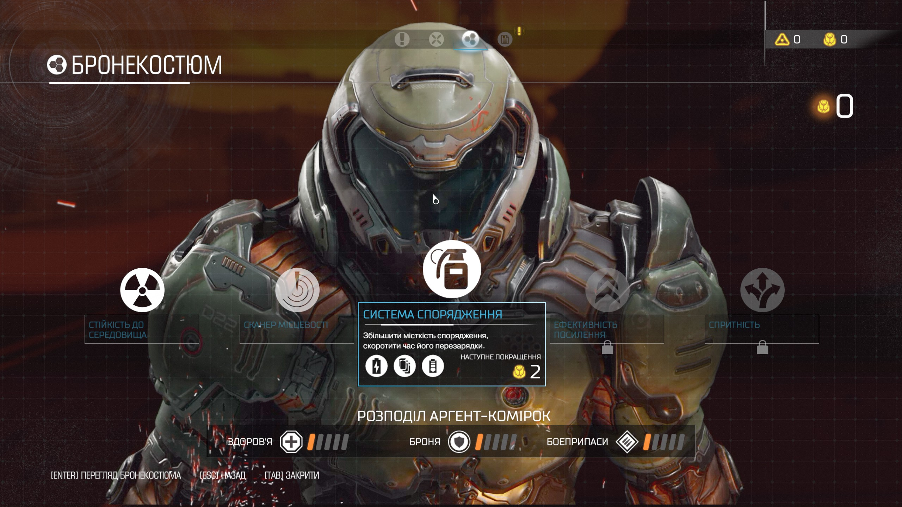
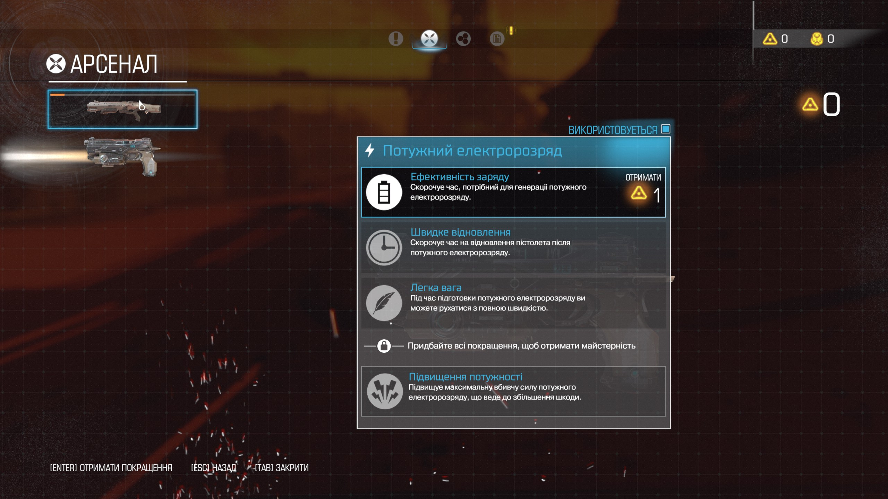
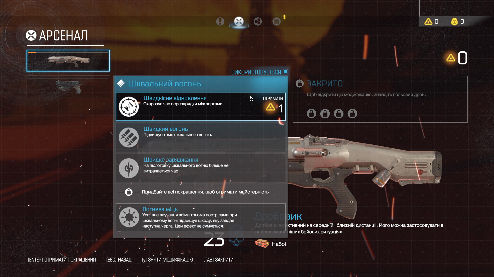
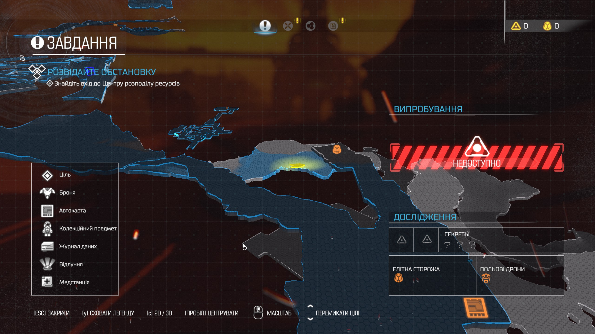

# Українізатор DOOM (2016)

Фанатський проєкт перекладу **DOOM (2016)** українською мовою (на основі російської локалізації).

[](https://github.com/Makentosh/doom-2016-ukr/releases/latest)
[](https://github.com/Makentosh/doom-2016-ukr/releases)

> 📖 Посібник у Steam: [Українізатор DOOM (2016)](https://steamcommunity.com/sharedfiles/filedetails/?id=3793976717)

## Про переклад

**Переклад завершено на 100%!** Усі рядки текстового файлу локалізації гри перекладено українською:

- 🎮 Уся кампанія — сюжетні репліки, брифінги, кодекс
- 📦 Усі доповнення (DLC)
- 🗺️ Редактор карт SnapMap — інтерфейс, логічні об'єкти, назви модулів, Академія Snap
- 🤖 Голосові репліки ВЕГИ, Предка та демонів (субтитри)
- ⚔️ Усі мультиплеєрні меню, режими гри, зброя, руни, модулі злому
- 🛡️ Броня, кольори кастомізації, статистика, медалі, виклики та нагороди

## Встановлення

**1. Завантажте архів**

Останню версію `UkrLoc_Installer.zip` беріть на сторінці
👉 [**Releases**](https://github.com/Makentosh/doom-2016-ukr/releases/latest)

**2. Розпакуйте в теку гри**

Розпакуйте вміст архіву (`Install_UkrLoc.bat`, `Uninstall_UkrLoc.bat`, `UkrLoc.zip`, `DOOMModLoaderSettings.txt`) у корінь теки з грою — туди, де лежить `DOOMx64.exe`. Зазвичай це:

```
...\SteamLibrary\steamapps\common\DOOM\
```

**3. Запустіть інсталятор**

Запустіть `Install_UkrLoc.bat`. Скрипт сам:

- перевірить, що ви в правильній теці гри;
- за потреби завантажить [DOOMModLoader](https://github.com/ZwipZwapZapony/DOOMModLoader) з GitHub;
- скопіює `UkrLoc.zip` у теку `Mods`;
- застосує переклад через DOOMModLoader.

**4. Грайте** 🤘

Запускайте гру як зазвичай через Steam — інтерфейс і текст будуть українською.

## Видалення

Запустіть `Uninstall_UkrLoc.bat` у тій самій теці — він прибере мод і відновить оригінальні файли через DOOMModLoader.

## Проблеми зі встановленням?

- Переконайтеся, що `.bat`-файли лежать поруч із `DOOMx64.exe`, а не в підтеці.
- Якщо антивірус блокує завантаження DOOMModLoader — завантажте [DOOMModLoader](https://github.com/ZwipZwapZapony/DOOMModLoader) вручну, покладіть `DOOMModLoader.exe` у ту саму теку й запустіть `Install_UkrLoc.bat` ще раз.
- ⚠️ Мод сумісний лише зі **Steam-версією гри без DRM-захисту Denuvo**.

## Якщо десь лишився російський текст

Не весь текст гри зберігається у файлі локалізації. Деякі написи — це **текстури** (таблички, вивіски на стінах), **досягнення Steam** (налаштовуються розробником і локально не перекладаються) або текст, **вшитий у відеоролики**. Такі місця виправити перекладом рядків неможливо — знадобився б окремий текстурний мод.

Якщо натрапите на пропущений рядок звичайного інтерфейсу — [створіть Issue](https://github.com/Makentosh/doom-2016-ukr/issues) з точним текстом або скріншотом, і я доперекладу, якщо він є у файлі.

## Скріншоти

| | |
|---|---|
|  |  |
|  |  |
|  |  |
|  |

## Подяка

Дякую, що завантажили мій українізатор — це моя перша локалізація, і над нею була пророблена велика робота!

Окрема подяка [ZwipZwapZapony](https://github.com/ZwipZwapZapony/DOOMModLoader) за DOOMModLoader.

**Слава Україні!** 🇺🇦
